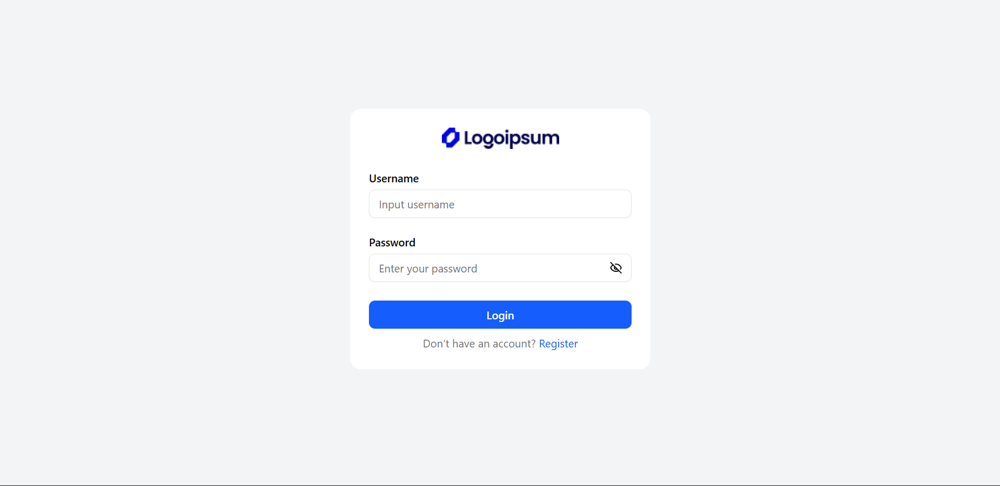

<h1 align="center">
  Article App
</h1>
<div align="center">
  
</div>


## Description

Article App adalah platform manajemen artikel yang mendukung dua jenis peran pengguna: User dan Admin. Sistem dilengkapi dengan fitur autentikasi dan otorisasi, sehingga akses ke fitur-fitur dalam aplikasi dibatasi berdasarkan peran masing-masing pengguna.

## Built With

- [Next.js]
- [Tailwindcss]
- [Shadcn]
- [Axios]
- [zod]
- [Lucide-icon]

## 🛠 Installation & Set Up

1. Clone the repo
   ```sh
   git clone https://github.com/rdhss/article-app.git
   ```
1. change dir
   ```sh
   cd article-app
   ```
2. Install NPM packages
   ```sh
   npm install
   ```
3. Start the Application
   ```sh
   npm run dev
   ```
